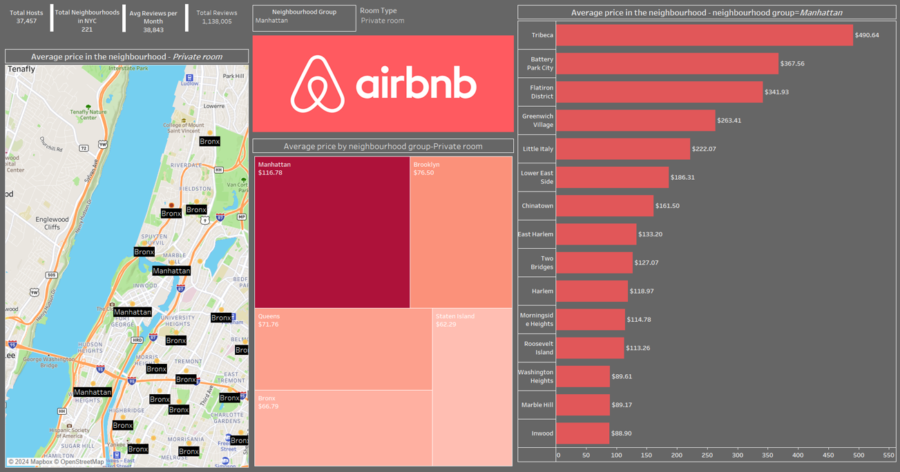
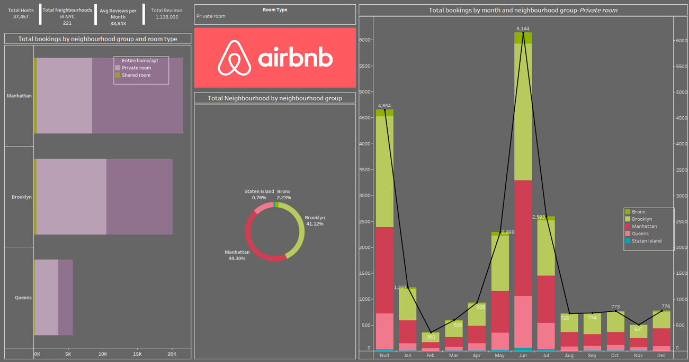
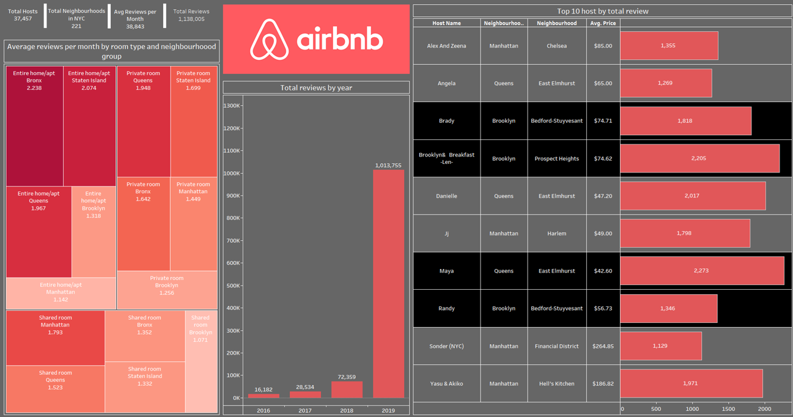

# Airbnb Tableau Dashboard

This project presents a Tableau dashboard created to analyze Airbnb data. The dashboard helps clients understand pricing trends, booking variations, and market opportunities in different areas. The insights provided can assist property owners in making data-driven decisions for maximizing profits and finding ideal locations for their listings.

## Key Features

- **Pricing Analysis**: Understand average prices based on location and room types.
- **Seasonal Trends**: Analyze how bookings vary across different seasons and locations.
- **Market Opportunities**: Identify potential areas for market penetration with affordable pricing.

## Dashboard Previews

### 1. Pricing Trends by Location

*This image shows how prices for Airbnb properties vary by neighborhood and room type.*

### 2. Booking Trends Across Seasons

*Visualize the booking variations during peak seasons compared to off-seasons.*

### 3. Market Opportunity Map

*Identify the best opportunities for market entry based on pricing and competition in different areas.*

## Full Report

For more detailed analysis, you can download the full PDF report that contains additional insights, data points, and visualizations:

[Download Full PDF Report](./AIRBNBFINAL.pdf)

## Tech Stack

- **Tableau**: For data visualization and dashboard creation.
- **Airbnb Dataset**: The dataset used includes pricing, booking, and location details from Airbnb.
  

## License

This project is licensed under the MIT License.
